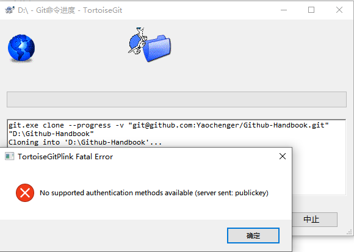
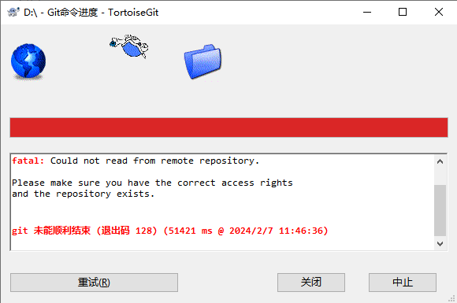
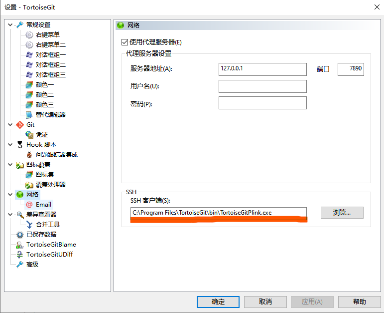
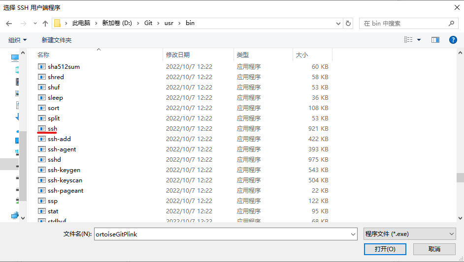
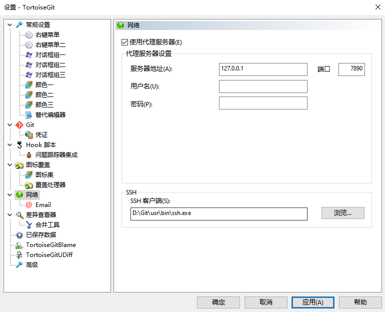

# 问题：git clone使用ssh报错: 

# No supported authentication methods available

# (server sent: publickey) 

# 解决办法：

详细问题如下：

```c
在使用 TortoiseGit 客户端将远程代码 Pull 到本地的时候，出现异常，Pull 失败，并提示错误信息 “ Disconnected: No supported authentication methods available(server sent: publickey) ”
```





```c
接下来，我们需要修改 TortoiseGit 网络的 SSＨ 客户端为 git 服务器的 ssh.exe （前提条件：本地必须已经安装 git 服务器）
```

```
在修改前，TortoiseGit 使用的是自己的 TortoiseGitPlink.exe 作为 SSH 客户端，鼠标右键 -> TortoiseGit -> Settings -> Network -> SSH Client 项，如下图：
```



```c
点击 “ Browser ” 找到在本地安装的 git 服务的根目录 -> Git -> usr -> bin 目录下选中 ssh.exe ，再点击打开即可，如下图
```



```
回到 客户端后，点击 “ 应用 ” 即可，如下图：
```



完成上述工作后我们就可以正常使用SSH与Github进行通讯了。