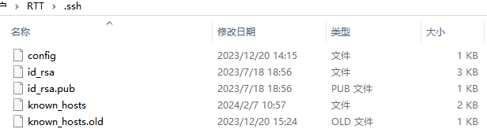
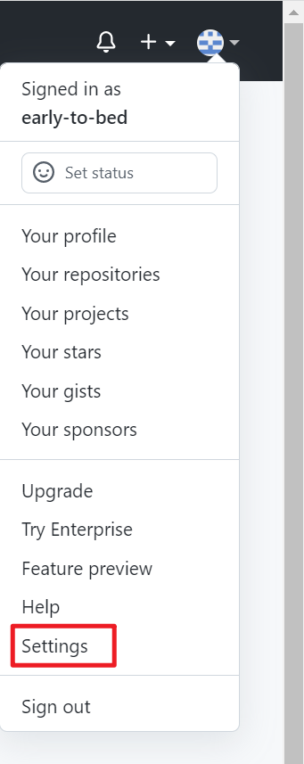
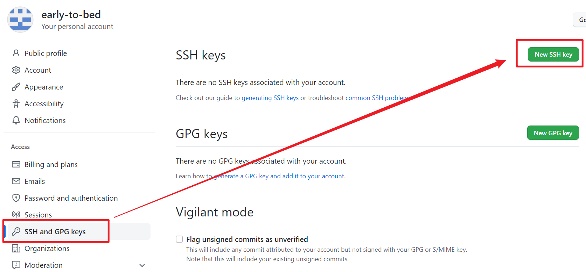
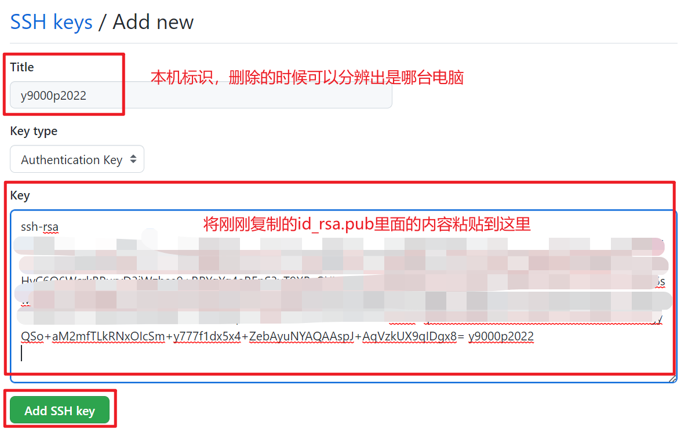

# [Github入门]-使用SSH与Githubh进行文件拉取与上传

## 1 下载GIT

[GIT工具下载链接](https://git-scm.com/downloads)

## 2 注册Github账号

[Github网址](https://github.com/)

## 3 设置GIT工具的用户名与邮箱并生成密钥

完成上述工作后，在桌面右击鼠标可以看到下述选项：


选择`Git Bash Here`.

### 3.1 首先配置GIT工具的用户名与GIT工具邮箱

首先声明:此处的用户名并不是`Github`的用户名与邮箱；如果不理解可以想象还有`gitee`,`gitlab`又不止`github`可以存储代码

配置命令：

```shell
git config --global user.name "你的用户名"
git config --global user.email "你的邮箱"
```

配置好的 Git 的用户名和邮箱存储在 `C:\Users\账户名` 目录下的 `.gitconfig` 文件中，可以使用如下命令查看：

```shell
git config --list
```

这是我本地`.gitconfig` 文件中的信息：

```gas
[user]
	name = Yaochenger
	email = 151xxxxxxx@qq.com
[http]
	sslverify = false
	proxy = http://xxx.x.x.x:xxxx
[core]
	autocrlf = true
[credential "https://gitee.com"]
	provider = generic
[credential "https://git.xxxx.com"]
	provider = generic
[credential "https://codeup.xxxx.com"]
	provider = generic
	...
```

使用`git config --list`获取的信息：

```shell
user.name=Yaochenger
user.email=151xxxxxxx@qq.com
```

### 3.2 与Github通讯的两种方式

**HTTPS**：需要个人访问令牌。即使没有配置个人访问令牌，也是可以 git clone 的，但是 git push 的时候需要输入用户名和个人访问令牌。

**SSH**：需要密钥对。如果没有配置密钥对，既不能 git clone，也不能 git push。

> 通常访问Github需要梯子，相比http协议ssh协议更适合一些。（解决问题时适合才是最重要的）

所以本文仅完整介绍SSH的方式。

### 3.3 生成SSH密钥对

生成密钥的命令：

```c
ssh-keygen -t rsa -C "本机标识"
```

上述命令介绍：

`ssh-keygen`: 命令主体

`rsa`: 非对称加密协议

`-C `: 本机标识，`-C` 只是给产生的密钥对加了一个注释，建议填写跟当前机器相关的内容

> 上述过程会指定生成的密钥的路径与登录密码的设置，建议不修改，不设置（能用了在说）

生成的 SSH 密钥对存储在 `C:\Users\账户名\.ssh` 目录下，如下图所示：



接下来在`Git Bash Here`中输入下述命令就可以将我们所需要的信息复制到剪贴板。

```c#
clip < ~/.ssh/id_rsa.pub
```

## 4 Github端配置

在Github中打开下述选项：



进一步选择下述选项：



执行下述操作：



ssh配置测试：

在`Git Bash Here`中输入下述命令：

> ssh -T git@github.com

运行结果：

```shell
$ ssh -T git@github.com
Hi Yaochenger! You've successfully authenticated, but GitHub does not provide shell access.
```

至此SSH的配置就完成，可以使用SSH与Github尽情玩耍了。


## QAQ

1. 如果克隆仓库失败可以查看下文：

   Erorr1.[No supported authentication methods available(server sent: publickey) ](../error/readme.md)

2. 非常好的参考博客

   [基于 SSH 协议配置 Git 连接 GitHub](https://blog.csdn.net/qq_42815188/article/details/128735530?ops_request_misc=%257B%2522request%255Fid%2522%253A%2522170727500516800227494519%2522%252C%2522scm%2522%253A%252220140713.130102334..%2522%257D&request_id=170727500516800227494519&biz_id=0&utm_medium=distribute.pc_search_result.none-task-blog-2~all~sobaiduend~default-1-128735530-null-null.142^v99^pc_search_result_base6&utm_term=ssh%20github&spm=1018.2226.3001.4187)

