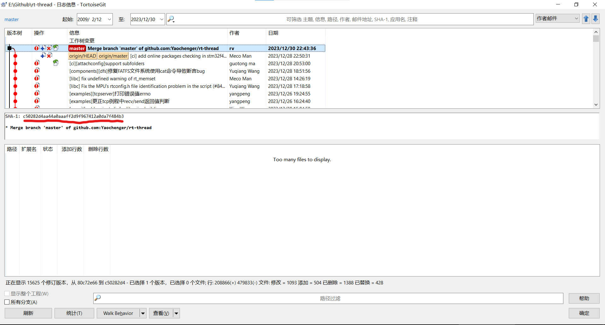

# git使用笔记（一）

## 1.获取版本节点编号

下述的编号是节点的唯一编号

将上述编号复制到所在仓库，即可查到该节点。

当然使用提交的名称 结合时间 作者名也能找到，但是这些不能作为唯一的凭证。在同步时上述的编号可以作为同步的commit messenge.

## 2.同一个pr中可能会包含许多的commits,每个commit的信息（message）一定要符合该笔commit，尤其是同步代码时，将同步的分支 节点 时间写上

## 3.cherry pick 可以单独获取某笔commit(提交)，在需要废弃一个大的提交，选择性的选择其中几笔提交时非常好用。

这种方式的本意:挑选感兴趣的樱桃，很形象，git管理工具的作者一定很喜欢吃樱桃

